# 🌳 Yggdrasil Panel

**Yggdrasil Panel** is a self-hosted **game & app server control panel** for
Debian/Ubuntu (Docker) — think *AMP + Pterodactyl, but radically easier to
install, update and maintain*, and not just for games: run databases and homelab
apps (Vaultwarden, Gitea, Uptime Kuma, Grafana, WordPress, Nextcloud…) from the
same one-click "Runes".

[**📖 Documentation**](docs/) · [**🌐 yggdrasilpanel.com**](https://yggdrasilpanel.com) · [**💬 Discord**](https://discord.gg/QM6TmJYvMS)

[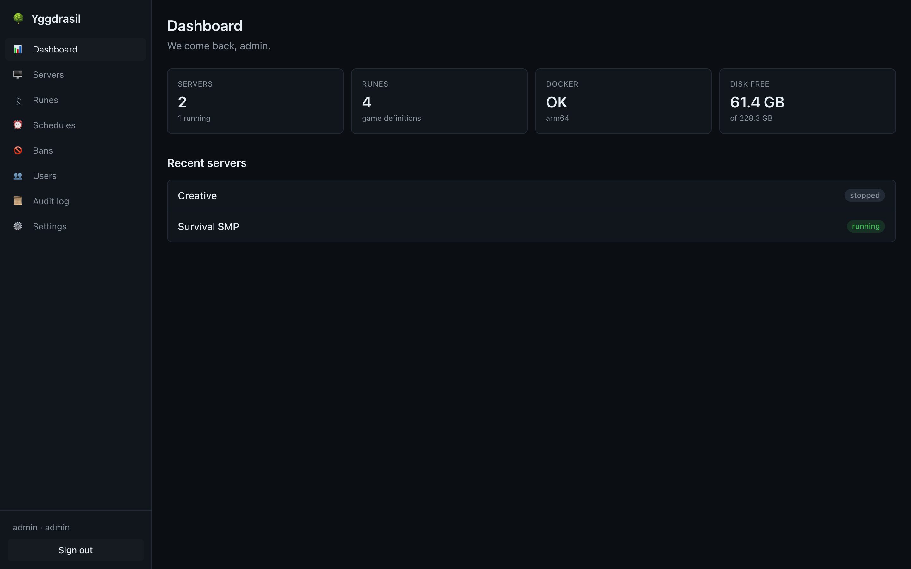](docs/screenshots/dashboard.png)

- **One binary.** A single static Go binary with the web UI embedded. No separate
  database, no Redis, no required reverse proxy.
- **One command to install.** The installer handles Docker and everything else.
- **Extensible.** A game *or app* = one declarative **gameskill** file (shown as a
  *Rune* in the UI). Minecraft Java, Minecraft Bedrock, Uptime Kuma and Vaultwarden
  are built in; a growing library of **community runes** — DayZ, Rust, Terraria,
  Factorio, databases and homelab apps — is in [`community-runes/`](community-runes/)
  to import in one click.
- **Installable PWA.** Mobile-friendly, dark mode, works as an app on iOS/Android.

> ⚠️ Early development. See [PROGRESS.md](PROGRESS.md) for the phase-by-phase status.
>
> 🤖 **Built with [Claude Code](https://claude.com/claude-code).** Provided **as‑is**,
> with **no warranty and no liability whatsoever** — you use it entirely at your own
> risk. See the [Disclaimer](#disclaimer) below.

## Install

```bash
curl -fsSL https://raw.githubusercontent.com/kristianwind/yggdrasil/main/install.sh | sudo bash
```

The installer detects your distro, installs Docker if missing, creates a
dedicated service user, drops a systemd unit, and prints your login URL and a
generated admin password. Re-running it upgrades or repairs an existing install.

Updating later is just: swap the binary + restart the service (or re-run the
one-liner — it's idempotent).

## Documentation

**[📖 Full documentation](docs/)** — or jump straight to
**[Getting started](docs/getting-started.md)**, which takes you from a bare box to a
running game server.

Guides for [servers](docs/guides/servers.md), [runes](docs/guides/runes.md),
[users & permissions](docs/guides/users-and-permissions.md),
[backups & schedules](docs/guides/backups-and-schedules.md),
[networking](docs/guides/networking.md),
[monitoring & alerts](docs/guides/monitoring-and-alerts.md),
[notifications](docs/guides/notifications.md), and
[Kvasir, the AI assistant](docs/guides/kvasir-ai.md).
Reference: [configuration](docs/reference/configuration.md),
[HTTP API](docs/reference/api.md), [rune schema](docs/reference/rune-schema.md).

## Key features

**Servers & runtime**
- Create / start / stop / restart / delete servers, each in its own Docker
  container with **per-server CPU & RAM limits** and clean isolation
- **Real-time console** (WebSocket) with command input, plus live **log streaming**
- One-time **install flow** that runs the gameskill's setup in an ephemeral
  container with live progress (e.g. downloads the right Paper/Vanilla/Fabric jar)
- **Live status** — `installing → starting → running → stopped` with a clear
  *starting* state until the server logs it's actually ready to accept players
- **Restart-on-crash** + crash detection; conflict-free **port allocation** with
  per-server ports published 1:1 for Steam games (so they advertise correctly)
- **Resource monitoring** (CPU / RAM) and **player count / status** via query
  protocols (A2S for Steam games, Minecraft Java SLP, Bedrock ping)
- **RCON** where the game has it — Source/Minecraft (TCP), Rust (WebSocket),
  DayZ (BattlEye)
- **Reclaims disk on delete** — removing a server frees its full data directory
  (game files, world, configs), and Steam installs **pre-check free space** with a
  clear error instead of a cryptic Steam failure
- **Graceful stop** — rune-tunable shutdown grace period + an optional pre-stop
  save command, so games that flush persistence on shutdown (DayZ's Central
  Economy, Minecraft) aren't `SIGKILL`'d mid-save on a restart

**Live admin & moderation** (rune-declared, generic across games)
- **Safe restart** — broadcast an in-game **countdown** to players first
  (rune-declared warnings), with an optional pre-restart backup; manual or scheduled
- **Auto-restart** — a per-server "restart every N hours" toggle, managed for you
  (a scheduled restart under the hood, with the same warnings + backup options)
- **Watchdog / auto-heal** — when a running server stops answering its query for
  several checks in a row (hung, not merely crashed), the panel auto-restarts it and
  notifies, with a cooldown so it never restart-loops
- **Wipe** — reset a game's world / persistence (rune-declared paths) behind a
  confirm dialog with a **backup-first** option; config, whitelist and mods are kept
- **Players tab** — a live roster over RCON with **kick**, **broadcast** and
  **lock joins**, all rune-declared (DayZ via BattlEye BERcon)
- **Activity feed** — the game's admin log parsed into joins / disconnects /
  deaths / kills, newest first (rune declares the log path + parse patterns)

**AI assistant** (optional, advisory — bring your own LLM)
- Wire up **any** provider — OpenAI, Anthropic, OpenRouter, DeepSeek, Mistral,
  Ollama, or any OpenAI-compatible endpoint — key stored **encrypted**; off by default
- **Activity digest** — a plain-language *"what happened while I was away"* summary
  of the admin-log feed with anomaly flags. Strictly **opt-in**, **read-only**, and
  it never acts on a server by itself; nothing is sent anywhere you didn't configure

**Games & apps (gameskills / "Runes")**
- Bundled core: **Minecraft Java, Minecraft Bedrock, Rust, DayZ** — DayZ with
  **Workshop mods** (auto-downloaded + signed) and BattlEye RCON, plus a **Mods
  tab** that shows each mod's on-disk + live Steam Workshop status (so a mod
  removed upstream is flagged instead of silently breaking joins)
- **Browse GitHub** — install community runes with one click straight from a repo's
  YAML folder (defaults to this repo's [`community-runes/`](community-runes/),
  grouped into `databases/` `apps/` `games/`); or upload a `.yaml` yourself
- **Community runes** (grouped, ~25 and growing): **databases** (MongoDB, MariaDB,
  PostgreSQL); **apps** (Vaultwarden, Gitea, Uptime Kuma, Grafana, Jellyfin,
  WordPress, Nextcloud, n8n, Memos, Homepage, phpMyAdmin, Adminer, Portainer,
  Pi-hole, IT-Tools, Excalidraw, CyberChef, linkding, Stirling-PDF, Dozzle,
  FreshRSS, Mealie); **games** (Terraria, Factorio, Luanti/Minetest,
  Genshin/Grasscutter)
- **Not just games** — a rune is just a Docker image + ports + env, so most things
  that run in Docker run here. Rune fields `data_path` (where the volume mounts),
  `user` (run-as uid) and `keep_entrypoint` (use the image's own entrypoint) make
  off-the-shelf app images first-class
- Author your own in declarative YAML; auto-generated settings form
  (string/int/bool/**dropdown**) per rune
- **Import** existing definitions: Pterodactyl **eggs** (JSON) and **XML**
- **Steam authorization**: anonymous by default; a one-time login flow for games
  that require an account (DayZ), with the SteamCMD cache persisted so Steam Guard
  isn't re-triggered

**Organize & control access**
- **Realms** to group servers; default grouping by game type, custom realms supported
- **Multiple admins with scoped permissions** — grant `view / control / console /
  files / create / delete / backup / schedule` at **global / realm / game-type /
  single-server** scope
- Built-in **file manager** + config editor (browse, edit, upload, download)
- Full **audit log** of admin actions; **API tokens** to drive everything from
  automation (a documented REST API)
- Optional **2FA (TOTP)** on login

**Networking & connectivity**
- **Automatic port forwarding** — when a server starts, Yggdrasil opens its ports
  on your router and closes them again when the last server using them stops:
  - **UPnP/IGD** for consumer routers (toggle in Settings → Network)
  - **UniFi OS** (UDM / UDR / Cloud Key G2+) via the local Network API — enter the
    gateway URL + a local admin, **Test connection**, and rules are managed for you
    (tagged `[ygg:…]` so it only ever touches its own forwards)
  - **Per-server toggle** — choose whether each server opens its firewall ports
    (default on) or stays LAN-only
- **"Online from outside" check** — the panel probes each server on its **public**
  address (not just localhost) and shows a 🌐 reachable / 🚫 badge, so you can
  confirm at a glance that the port-forward actually works from the internet
- **Connect address** shown per server — the panel detects your public IP (or uses
  a hostname you set) and shows the exact `host:port` players join on
- **BattleMetrics** (optional) — set a server's BattleMetrics ID for a live
  online/players/rank badge on its page
- **Update notifications** — the panel checks GitHub releases and shows an
  in-app banner when a newer Yggdrasil is available

**Automation & operations**
- **Backups** to local / mounted NFS-CIFS, **SFTP**, or **SMB** — on-demand or
  scheduled, with **restore** and **retention** (keep N / X days)
- **Scheduler** (cron) for backups, restarts, updates, start/stop, console
  commands, and **in-game messages** with editable templates (`{{minutes}}`,
  `{{server_name}}`) and a "skip if players online" guard
- **Notifications** via Telegram, Discord, generic webhook, or email (SMTP) —
  server up/down, backup done/failed, **low disk**
- **Disk dashboard** with a low-space alert

**Anti-cheat & moderation**
- Per-game **anti-cheat surface** (Paper anti-xray hints, BattlEye/EAC status,
  recommended plugins)
- **Centralized cross-server ban list** — ban a player on one server or everywhere
  at once, pushed via RCON/console
- **Violation auto-actions** — watch logs for a pattern and auto-kick/ban when it
  recurs past a threshold

**Security**
- Passwords hashed with **argon2id**; RCON / backup / Steam credentials
  **encrypted at rest** (AES-256-GCM) and never logged
- Login **rate-limiting**, secure headers, CSRF-safe token auth, path-traversal
  guards on file access

## Screenshots

| Dashboard | Server console & live stats |
|---|---|
| [](docs/screenshots/dashboard.png) | [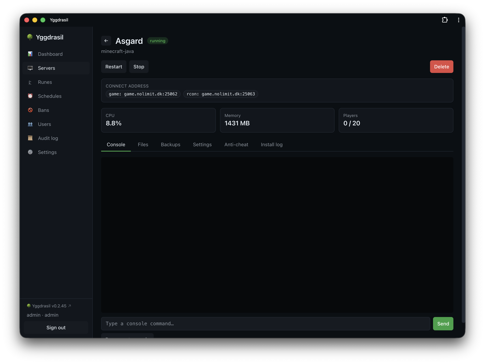](docs/screenshots/server-console.png) |
| **Servers** | **Anti-cheat** |
| [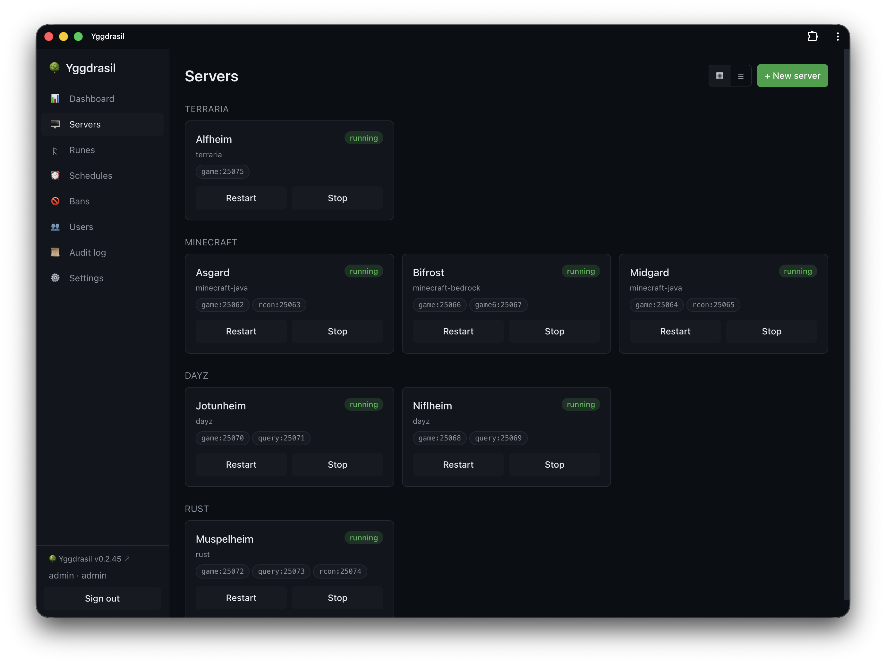](docs/screenshots/servers.png) | [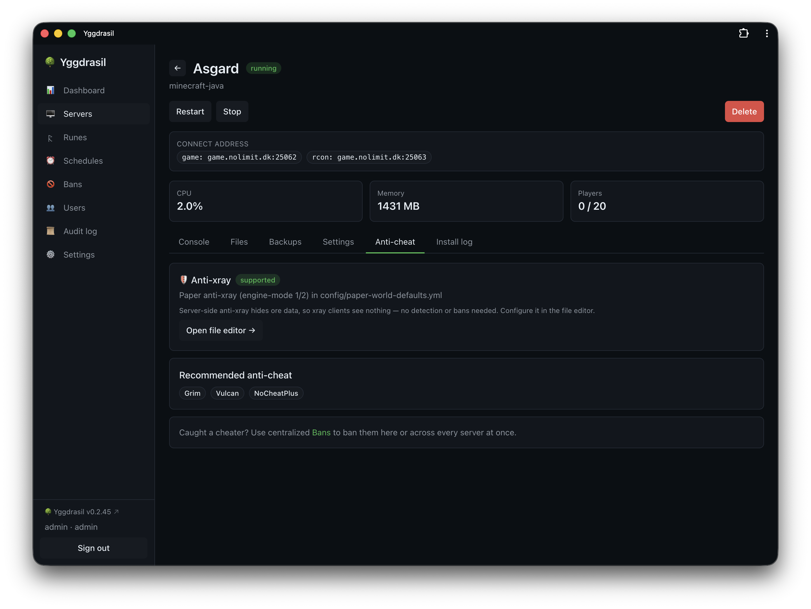](docs/screenshots/server-anticheat.png) |
| **Schedules** | **Bans & auto-actions** |
| [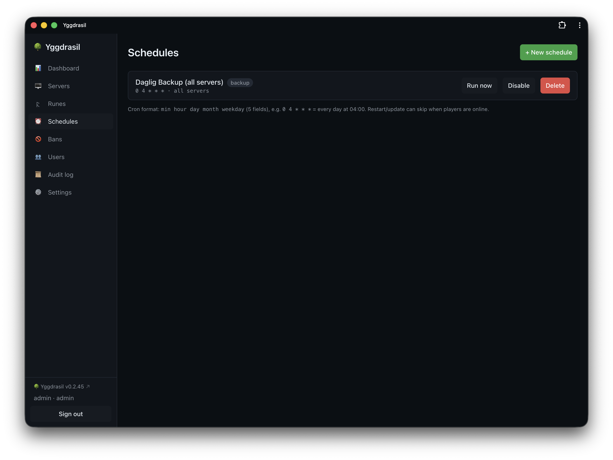](docs/screenshots/schedules.png) | [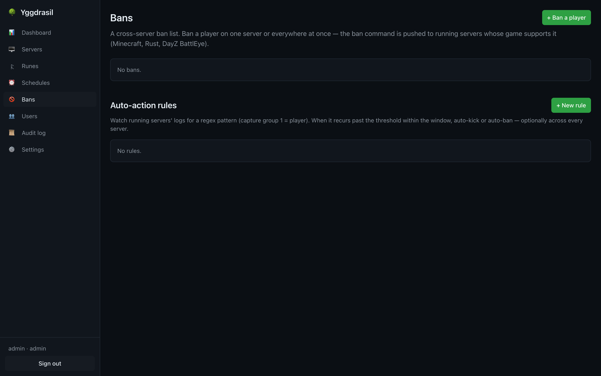](docs/screenshots/bans.png) |
| **Runes (gameskills)** | **Settings** |
| [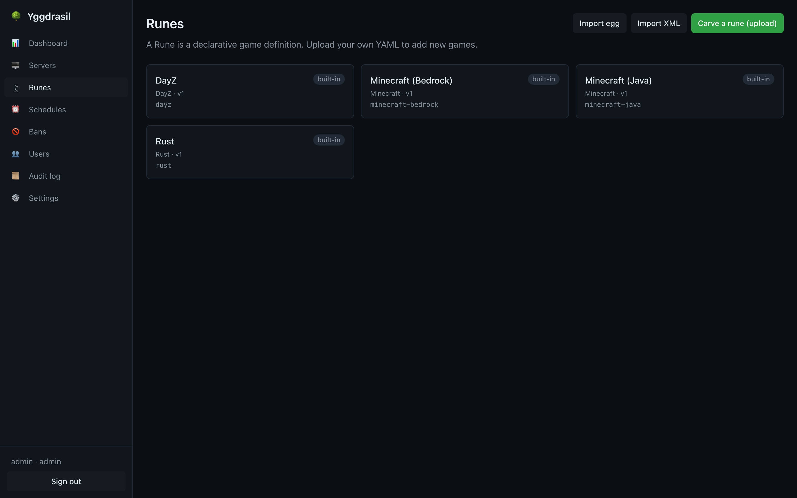](docs/screenshots/runes.png) | [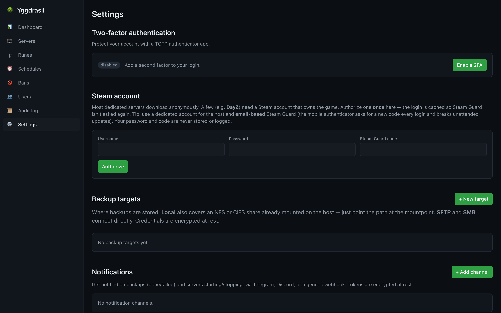](docs/screenshots/settings.png) |
| **Server settings** (connect address, BattleMetrics, delegation) | **Users & scoped access** |
| [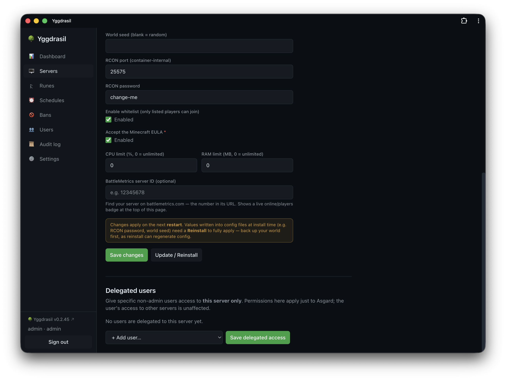](docs/screenshots/server-settings.png) | [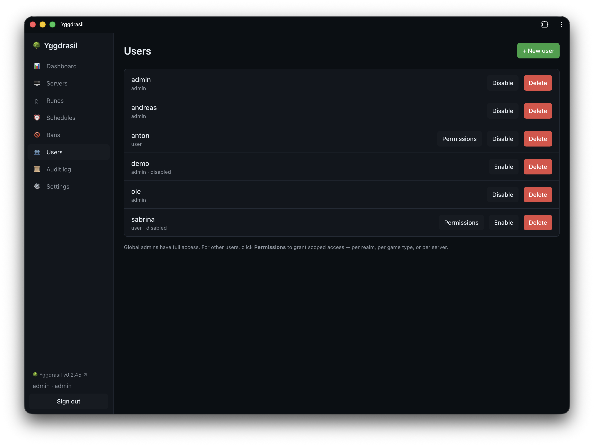](docs/screenshots/users.png) |
| **File manager** | **Backups & restore** |
| [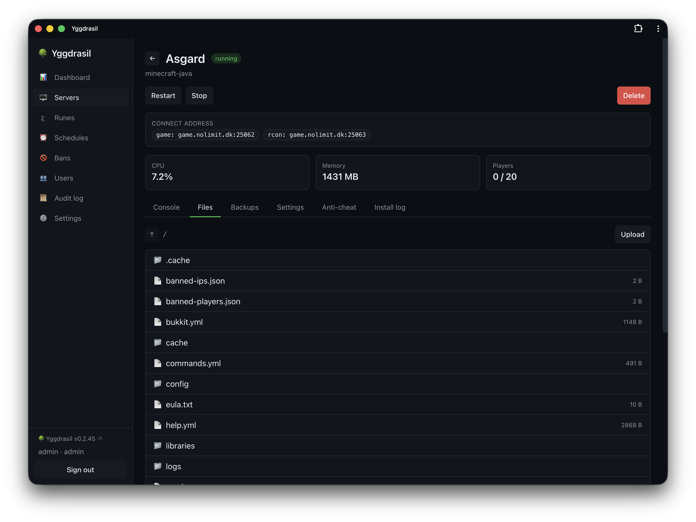](docs/screenshots/server-files.png) | [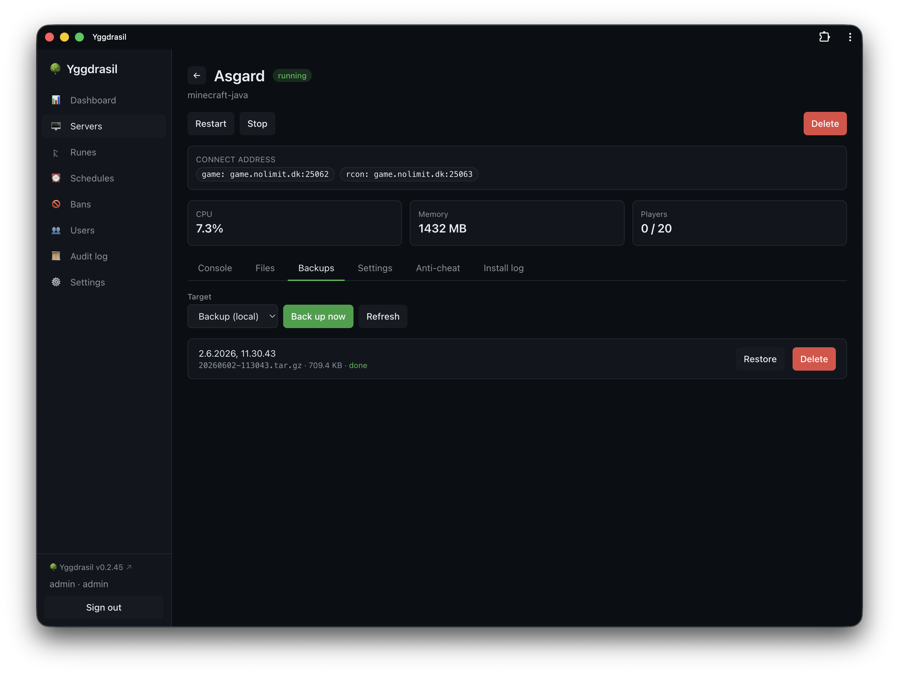](docs/screenshots/server-backups.png) |

<sub>Dark mode by default; the UI is fully responsive and installable as a PWA.</sub>

## Concepts

| Term | Meaning |
|------|---------|
| **Yggdrasil** | the whole panel |
| **Gameskill** (UI: *Rune*) | a declarative game definition (YAML). You "carve new runes" to add games. |
| **Realm** | a group/category of servers. Default grouping is by game type; custom realms supported. |

Each game server runs as its own Docker container — giving per-server CPU/RAM
limits, clean isolation, and portable per-game runtimes (JRE, SteamCMD) without
polluting the host.

## Run behind a reverse proxy (TLS)

Yggdrasil is a plain HTTP app on `:8080` (configurable). Put any reverse proxy in
front for HTTPS. The console, live logs, and install output are **WebSockets**, so
your proxy **must forward WebSocket upgrades** — this is the #1 cause of "it loads
but the console is blank".

### NGINX Proxy Manager (NPM)

In **Proxy Hosts → Add/Edit**:

| Field | Value |
|-------|-------|
| Domain Names | `yggdrasil.example.com` |
| Scheme | **`http`** (Yggdrasil terminates no TLS itself) |
| Forward Hostname / IP | the host running Yggdrasil, e.g. `192.168.1.158` |
| Forward Port | `8080` |
| **Websockets Support** | ✅ **ON** ← required for console / logs / install |
| Block Common Exploits | ON (fine) |
| SSL tab | request a Let's Encrypt cert, **Force SSL** + **HTTP/2** ON (fine) |

Long-running consoles can sit idle longer than a proxy's default read timeout.
Yggdrasil now sends WebSocket keepalive pings every 30 s, but if you still see the
console drop after a while, paste this into the host's **Advanced** tab:

```nginx
location / {
    proxy_pass       http://192.168.1.158:8080;
    proxy_http_version 1.1;
    proxy_set_header Upgrade $http_upgrade;
    proxy_set_header Connection "upgrade";
    proxy_set_header Host $host;
    proxy_set_header X-Forwarded-For   $remote_addr;
    proxy_set_header X-Forwarded-Proto $scheme;
    proxy_read_timeout  86400s;   # don't time out idle consoles
    proxy_buffering     off;      # stream install/log output immediately
}
```

### Troubleshooting

- **Page won't load at all through the proxy** → the proxy can't reach Yggdrasil.
  Make sure `server.host` in the config is `0.0.0.0` (not `127.0.0.1`), and from the
  proxy host run `curl http://192.168.1.158:8080` to confirm it answers.
- **Page loads, login works, but console/logs are blank** → Websockets Support is
  OFF. Turn it ON (or add the Advanced snippet above).
- **Console drops after ~1 minute** → proxy read timeout; add `proxy_read_timeout`
  as above.

> Verified: page load, login, and the WebSocket `101 Switching Protocols` upgrade
> all pass through an NGINX reverse proxy — no app-side changes are needed beyond
> enabling WebSocket forwarding on the proxy.

## Development

Requirements: Go 1.23+, and (optionally) Node 20+ for the frontend.

```bash
# Run the backend against a local config (Docker optional; it degrades gracefully)
go run ./cmd/yggdrasil --config ./dev-config.yaml

# Tests
go test ./...

# Build a static binary
CGO_ENABLED=0 go build -o yggdrasil ./cmd/yggdrasil
```

A minimal `dev-config.yaml`:

```yaml
server: { host: "127.0.0.1", port: 8080 }
database: { path: "./ygg.db" }
admin: { username: "admin", password: "changeme" }
```

See [ARCHITECTURE.md](ARCHITECTURE.md) for the design, the
[rune schema](docs/reference/rune-schema.md) for the gameskill format, and the
[API reference](docs/reference/api.md) for the HTTP API.

## Disclaimer

**Yggdrasil was built with [Claude Code](https://claude.com/claude-code), Anthropic's
agentic coding tool.** Much of the code, configuration, and documentation in this
repository was generated by an AI assistant.

**This software is provided "AS IS", without warranty of any kind**, express or
implied, including but not limited to the warranties of merchantability, fitness
for a particular purpose, and non‑infringement.

**There is absolutely no liability.** In no event shall the authors, contributors,
or anyone associated with this project be held liable for any claim, damages, data
loss, downtime, security incident, or other liability — whether in an action of
contract, tort, or otherwise — arising from, out of, or in connection with the
software or its use.

**You use Yggdrasil entirely at your own risk.** It manages game servers, runs
containers, executes install scripts, opens network ports, and stores credentials;
operate it only on systems and data you are willing to lose, keep your own backups,
and review what it does before running it in production. By installing or using this
software you accept full responsibility for any consequences.

## Community

[**Join the Discord**](https://discord.gg/QM6TmJYvMS) — questions, help getting a rune working,
and news about releases.

**Found a bug?** Please [open an issue](https://github.com/kristianwind/yggdrasil/issues) rather
than reporting it in chat. Issues don't scroll away, and they can carry the logs and version
information a fix actually needs. Discord is the right place to ask whether something *is* a bug.

## License

Yggdrasil Panel is free software under the
**[GNU Affero General Public License v3.0](LICENSE)**.

Run it, study it, share it, change it. The *Affero* part is the one that matters for a
panel: if you modify it and other people use your modified version over a network, they're
entitled to your modified source. Running it — modified or not — for yourself, your friends
or your community carries no obligation beyond keeping the notices intact. Selling hosting
built on a closed fork does.

The panel links to its own source from the sidebar, so anyone using an instance can find it.
If you fork it, point that link at *your* fork — that's what §13 asks for, and it's one
string.

Copyright © 2026 Kristian Wind.
