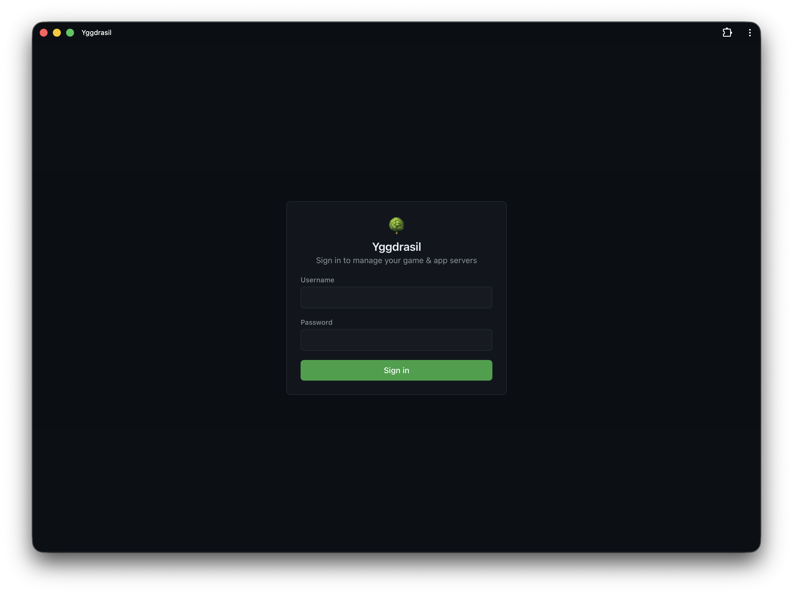

# Getting started

From a bare Debian or Ubuntu box to a running game server. Budget about fifteen minutes, most of it
spent waiting for a download.

## Before you start

You need:

- A **Debian or Ubuntu** host, `amd64` or `arm64`. The installer refuses other distributions.
- **Root** access.
- Enough disk for the games you plan to run. A Minecraft server is a few hundred MB; DayZ and Rust
  are several GB each, and Steam needs room to stage a download on top of that.
- **Docker** — the installer installs it if it's missing.

Yggdrasil Panel does not need a database server, a reverse proxy, or a message queue. It's one
static binary with the web UI embedded and SQLite for storage.

## Install

```bash
curl -fsSL https://raw.githubusercontent.com/kristianwind/yggdrasil/main/install.sh | sudo bash
```

The installer detects your distribution, installs Docker if needed, creates a dedicated `yggdrasil`
system user, writes `/etc/yggdrasil/config.yaml` with a generated secret key and admin password,
drops a systemd unit, and starts the service.

It's idempotent. Re-running it upgrades the binary and repairs a broken install, and it leaves an
existing config file untouched.

When it finishes it prints your login details:

```text
   URL:   http://192.168.1.50:8080
   Login: admin / <generated password>
```

If you missed them, the password is in `/etc/yggdrasil/config.yaml` under `admin.password`.

## First login

Open the URL and log in.

[](screenshots/login.png)

**Change the admin password now**, then remove the `admin:` block from
`/etc/yggdrasil/config.yaml` so a plaintext password isn't left on disk. The block only bootstraps
the first admin account — once an admin exists, Yggdrasil ignores it entirely, so deleting it is
safe and won't lock you out.

```bash
sudo nano /etc/yggdrasil/config.yaml   # delete the admin: block
sudo systemctl restart yggdrasil
```

While you're here, consider adding a second factor under **Settings** — Yggdrasil supports both TOTP
apps and passkeys. See [Users and permissions](guides/users-and-permissions.md).

## The layout

Nine things in the sidebar, four of them admin-only:

| Page | What it's for |
| --- | --- |
| **Dashboard** | Fleet overview, host CPU/RAM/disk, recent servers |
| **Servers** | Everything you run, and where you create more |
| **Runes** | The catalog of things you *can* run |
| **Schedules** | Cron jobs — backups, restarts, messages |
| **Domains** | Subdomains mapped to servers |
| **Bans** | Cross-server ban list |
| **Users** | Accounts and permissions |
| **Audit log** | Who did what |
| **Settings** | Integrations, backups, AI, network |

## Pick a rune

A **rune** is a recipe: one declarative YAML file that teaches Yggdrasil how to install, run, query
and manage one game or app. The panel ships with a handful embedded — Minecraft Java, Minecraft
Bedrock, Uptime Kuma, Vaultwarden, and a Cloudflare Tunnel connector — and a much larger catalog
lives in the repository.

Open **Runes**. To pull in the rest, click **Browse GitHub**, which lists the runes in
`community-runes/` and imports one with a click:

[](screenshots/runes.png)

- **games/** — DayZ, Rust, Terraria, Factorio, Luanti, and an experimental Genshin Impact
  (Grasscutter) rune
- **databases/** — MariaDB, PostgreSQL, MongoDB
- **apps/** — Gitea, Jellyfin, Grafana, n8n, Nextcloud, WordPress, Pi-hole, and more

Importing a rune only adds it to the catalog. Nothing runs yet.

Adding and removing runes is **admin-only**, deliberately: a rune chooses the container image, the
command, and the user it runs as, so being able to add one is effectively root on the host.

## Create your first server

Go to **Servers → New server**. Pick a **Rune**, give the server a **Name**, and optionally put it
in a **Realm** (a group — useful later for granting someone access to a set of servers at once).

The rest of the form is generated from the rune's variables, so it differs per game: Minecraft asks
for a Java version and a server type, DayZ asks for a mission. Set **CPU limit** and **RAM limit**
if you want them; `0` means unlimited.

You don't choose ports. Yggdrasil allocates free ones from its configured range (25000–30000 by
default) and deliberately does *not* use the game's well-known port — your Minecraft server will not
be on 25565. Off-default ports get scanned and hammered less. The server's page shows the real
connect address.

## Install it

A new server starts in the `installing` state. Yggdrasil runs the rune's install step in a
throwaway container — downloading the Paper jar, or running SteamCMD — and streams the output live.
Watch it; this is where a bad Steam credential or a full disk shows up.

Steam games take a while. A DayZ install is several GB.

## Start it

When the install finishes, hit **Start**. The status goes `starting` → `running`.

That intermediate state is real, not cosmetic: Yggdrasil watches the container log for the rune's
readiness pattern and only reports `running` once the game says it's accepting players. A server
sitting in `starting` forever usually means the process died or never printed the expected line —
open the console and look.

[](screenshots/server-console.png)

The console is interactive where the game supports it, and every server also has live log streaming,
a file browser, and RCON where the game offers it.

## Connect

The server page shows a **connect address**. On your LAN, that's it — you're done.

Getting players in from the internet needs one more step, because the panel can't open your router
for you unless you tell it how. The options, roughly in order of how much they'll annoy you:

- **UniFi** — if you run a UniFi gateway, give Yggdrasil its URL and credentials under
  **Settings → Network** and it creates and removes WAN port-forward rules as servers start and stop.
- **UPnP** — off by default, and off on most routers. Cheap to try.
- **Manual port forwarding** — forward the server's ports on your router yourself.
- **Cloudflare Tunnel** — no port forwarding at all, but HTTP(S) only, so it's for web apps, not games.

The server page has an **online from outside** check that probes your *public* address, so you can
tell "the game is up" apart from "the game is reachable".

One trap worth knowing before you hit it: a Cloudflare **proxied** (orange-cloud) DNS record only
carries HTTP and HTTPS. Point a Minecraft hostname at a proxied record and players cannot connect,
even though the server is perfectly healthy. Game hostnames need DNS-only (grey cloud).

The full picture is in [Networking](guides/networking.md).

## What next

You have a server. The things most people set up next:

- **[Backups](guides/backups-and-schedules.md)** — add a target, then a nightly schedule. The
  dashboard nags you about servers without a recent backup.
- **[Notifications](guides/notifications.md)** — Telegram, Discord, or a webhook, so you hear about
  a crash without watching the panel.
- **[Monitoring and alerts](guides/monitoring-and-alerts.md)** — CPU/RAM/disk alarms, the crash
  watchdog, and auto-restart.
- **[Users and permissions](guides/users-and-permissions.md)** — let a friend restart one server
  without handing over your admin account.

## Troubleshooting

**The panel won't start.**

```bash
sudo journalctl -u yggdrasil -f
```

**A server won't leave `starting`.** The process is up but hasn't printed its readiness line. Open
the console and read the log — a crash loop, a bad config, or a game that failed to bind its port.

**A server won't start at all.** Read the console output. For Minecraft specifically, the usual
cause is the EULA: the rune writes `eula.txt` from the `EULA` environment variable on every boot, so
editing the file by hand achieves nothing. Set `EULA` to `true` in the server's settings instead.

**Players can't connect but the server is healthy.** Check the *outside* reachability badge, not the
status dot. Then check your port forwarding, then check whether the hostname is behind a proxied
Cloudflare record.

## See also

- [Configuration](reference/configuration.md) — every key in `config.yaml`
- [Runes](guides/runes.md) — the catalog in depth
- [Servers](guides/servers.md) — lifecycle, files, console, cloning
